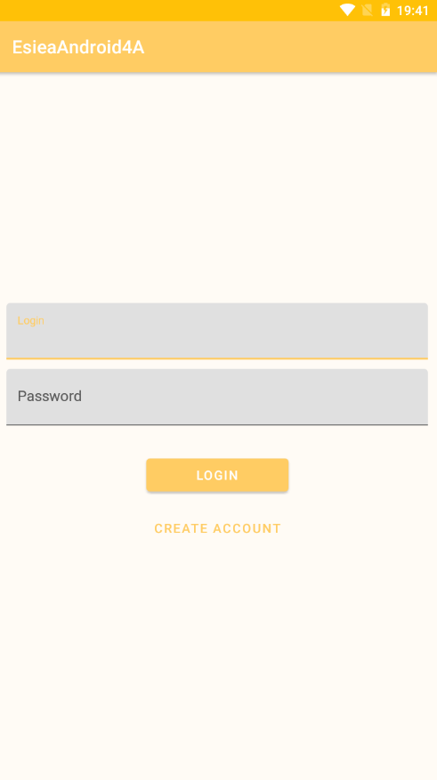
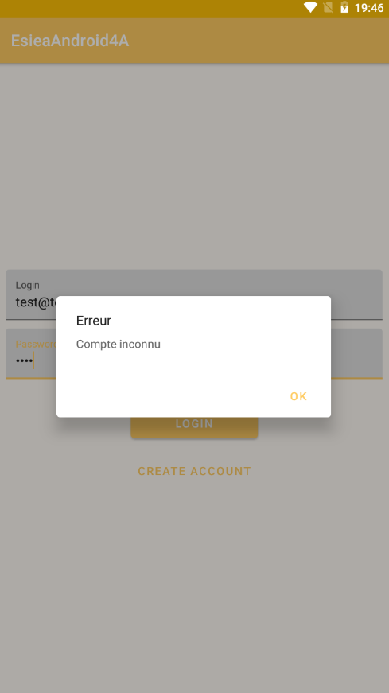
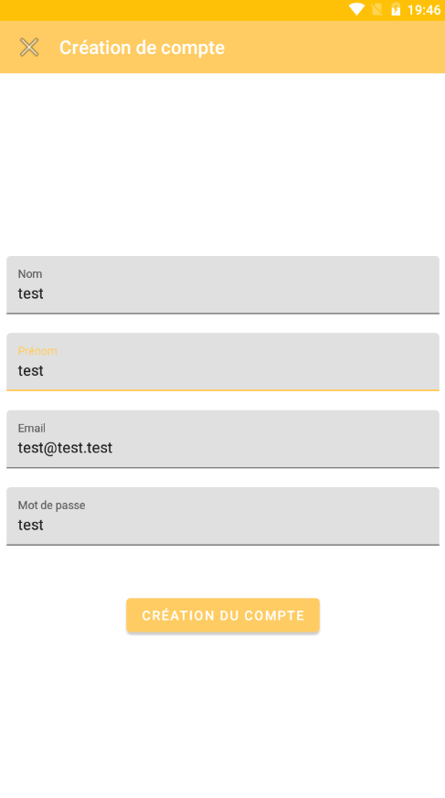

# Application Esiea Android 4A

## Présentation :

Projet d'une application Android dévellopée en kotlin qui fait suite au projet WhereParty avec l'ajout de fonctionnalité.

Cette application à pour but de trouver les évènements musicaux qui vont se passer bientôt à Paris .

## Fonctionnalités :

### Ecran de connection

- Il y a 2 champs qui permettent de renseigner un login et un mot de passe pour pouvoir se connecter
- Possibilité de créer un compte si l'utilisateur n'en n'a pas encore
- Si l'utilisateur essaye de se connecter avec un compte erroné, cela envoie un message d'erreur

 

### Ecran de création de compte

- Affiche les identifiants déjà renseigné dans les champs de l'écran précédent
- Demande un E-mail, un mot de passe ainsi qu'un nom et un prénom
- Une fois que tout est renseigné il n'y a plus qu'à appuyez sur le bouton Création du comptepour créer son compte et revenir sur l'écran de connection

### Ecrans liste d'evenement

- Après s'être connecté l'utilisateur se retrouve ici et peut voire les différent evenements qui se déroule à Paris dans les prochain jours
- Cela est un affichage de l'api SongKick.com

## Aspect utilisé :

### Pré-requis :

- Ecran avec un login et une création de compte
- Ecran avec une liste d'éléments
- Appel WebService à une API Rest
- Stockage de données en cache et en local pour les compte
- Language Kotlin

### Les plus :

- Architecture :
	- Design Patterns
	- MVVM
	- Principe SOLID
  - injection de dépendance
  - Clean Architecture
- Design

### Autres :

- Couleur personnalisé
- Ajout d'une icon d'application personnalisé

